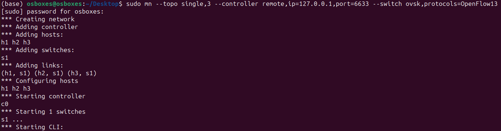
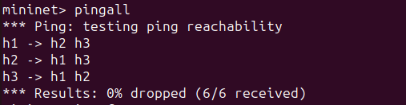
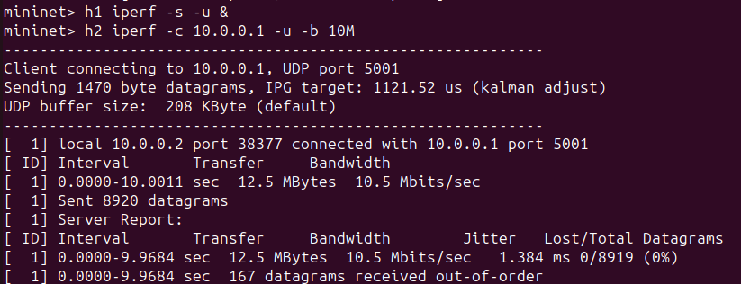
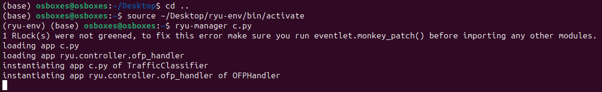
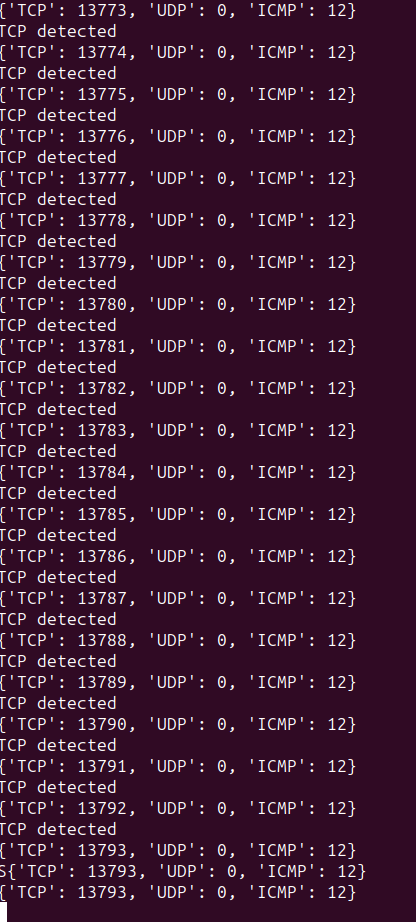
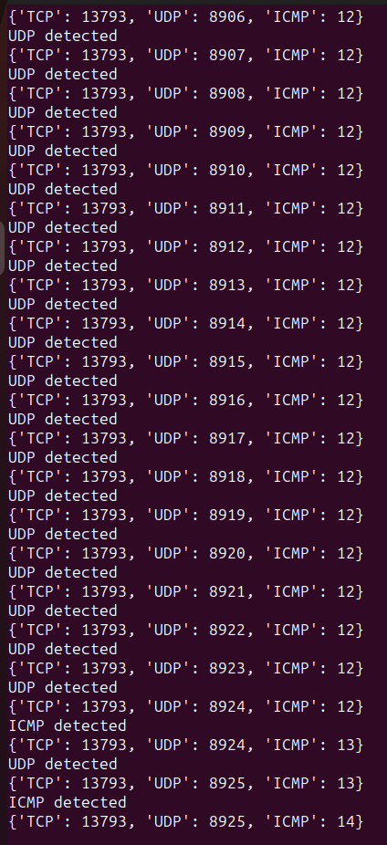
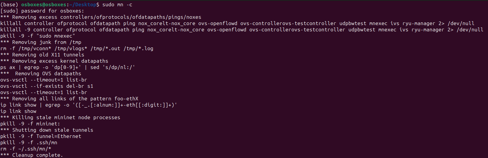

# Traffic Classification System using Ryu Controller

##  Project Overview

This project implements a Software Defined Networking (SDN) application using the Ryu controller to classify network traffic based on protocol type.

The system detects and classifies:

* TCP traffic
* UDP traffic
* ICMP traffic

It also maintains real-time statistics and displays traffic distribution.

---

##  Objectives

* Identify TCP, UDP, ICMP packets
* Maintain protocol-wise statistics
* Display classification results
* Analyze traffic distribution

---

##  Tools & Technologies

* Mininet
* Ryu Controller
* Open vSwitch (OVS)
* Python

---

##  Network Topology

* 1 Switch (s1)
* 3 Hosts (h1, h2, h3)
* Remote Controller (Ryu)

---

##  Steps to Execute

### 1. Clean Mininet

```bash
sudo mn -c
```

---

### 2. Activate Virtual Environment

```bash
source ~/Desktop/ryu-env/bin/activate
```

---

### 3. Run Ryu Controller

```bash
ryu-manager c.py
```

---

### 4. Start Mininet

```bash
sudo mn --topo single,3 --controller remote,ip=127.0.0.1,port=6633 --switch ovsk,protocols=OpenFlow13
```

---

### 5. Test Connectivity (ICMP)

```bash
pingall
```

---

### 6. Generate TCP Traffic

```bash
iperf
```

---

### 7. Generate UDP Traffic

```bash
h1 iperf -s -u &
h2 iperf -c 10.0.0.1 -u -b 10M
```

---

##  Results & Screenshots

### 🔹 Network Setup



---

### 🔹 Ping Test (ICMP Success)



---

### 🔹 TCP Traffic Test


---

### 🔹 UDP Traffic Test



---

### 🔹 Ryu Controller Initialization



---

### 🔹 TCP Detection Output



---

### 🔹 UDP & ICMP Detection Output



---

### 🔹 Mininet Cleanup



---

##  Sample Output

```
TCP detected
{'TCP': 13773, 'UDP': 0, 'ICMP': 12}

UDP detected
{'TCP': 13793, 'UDP': 8925, 'ICMP': 14}

ICMP packet detected
{'TCP': 0, 'UDP': 0, 'ICMP': 3}
```

---

## Conclusion

The system successfully:

* Classified TCP, UDP, and ICMP packets
* Maintained real-time statistics
* Displayed traffic distribution

This demonstrates effective traffic classification using SDN.

---

##  Future Improvements

* Add GUI dashboard
* Store statistics in database
* Real-time visualization graphs

---

##  Author

Mallikarjuna Rao R V
SRN: PES1UG24AM155
